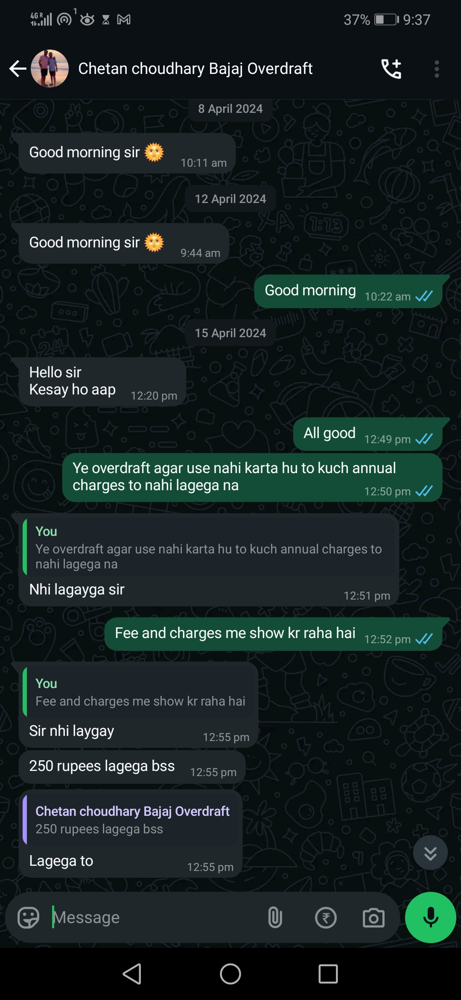

# Grievance 

- I am writing to formally raise a grievance regarding a fraudulent transaction related to a Bajaj loan, which was misrepresented to me as an Overdraft (OD) account. The account details are attached for your reference.

- At the time of opening the account, I was explicitly informed that I would not be required to pay any amount other than what I withdraw. However, once the account was opened, I discovered that several charges, including processing fees and stamp duty, amounting to ₹23,111, had been imposed. This was never disclosed to me beforehand.

- Upon confronting the Bajaj Finserv representative Yash Gole and his sales associate Chetan Choudhary, they agreed to refund the processing fee. The refund proof is attached as Document 2. This refund was only processed after I warned them of filing a complaint with the RBI.

## Further Misrepresentation and Unethical Practices

- As my OD account approaches 10 months, I am continuously receiving calls from Bajaj Finserv representatives pressuring me to accept additional charges. They have informed me that an AMC charge has been applied in their app and that it can be waived only if I purchase some insurance or other services or restructure/refinance. When I pointed out that this AMC charge was never disclosed at the time of account creation, they dismissed my concerns, stating:
"Sir, I am a program lead at Bajaj Finserv, and I know how Bajaj Finance operates. Filing complaints will not change anything."

- This statement is unacceptable and reflects a serious lack of transparency I request full forclosure of my account without any charges (as I have not approached them for Overdraft, I only accepted their offer as they said there are no charges on it).

## I have few call recordings and WhatsApp chats as evidence, which substantiate my claims. Below are the details:

1.    [Call Recording 001: Sales representatives assured me that all charges would be waived if I did not withdraw any amount. (+91 87646 47116 – 22/03/2024, 12:54 PM)](./001 In this call I kept deying OD but they said the they will waive off all charges if I dont withdraw any amount +91 87646 47116_20240322125409.m4a.mp3)

2.    [Call Recording 002: Another assurance was given that no charges would apply, as per the sales team's commitment. (+91 95486 32283 – 28/03/2024, 5:10 PM)](./002 He also said that there will be no charges as if sales team has commited +91 95486 32283_20240328171023.m4a.mp3) 
3.    [Call Recording 003: During the digital agreement process, I was repeatedly assured that there would be zero charges. (Chetan Choudhary – +91 87646 47116 – 30/03/2024, 12:30 PM)](./003 This is the call during digital agreement, your representative continiousely assures there is zero charges Chetan_choudhary_Bajaj_Overdraft@+91_87646_47116_20240330123025.m4a.mp3)
4.    [Call Recording 004: After the online process, I discovered additional charges in the Bajaj app. Upon raising concerns, the representatives offered a personal refund and again assured no charges if I did not withdraw funds. (Chetan Choudhary – +91 87646 47116 – 01/04/2024, 2:11 PM)](./004 App show charges and withdraw, I said i will report this then they agree to pay me on personal channel and assure there is no charges if I do not withdraw Chetan.m4a.mp3)
5. [Refund Received on UPI.pdf](./005 Refund received UPI.pdf)
6. Whatsapp chat screenshot, where he confirmed that if I don't withdraw there will be no AMC   

# Request for Resolution

1. Immediate foreclosure of the OD account with a waiver on foreclosure charges as they never inform about AMC.
2. A written/email confirmation that no further charges will be applied to my account.

#  .

###### Please resolve this issue, Otherwise, I will be left with no choice but to escalate the matter to the RBI Ombudsman and Consumer Court for unfair trade practices and financial misrepresentation.

